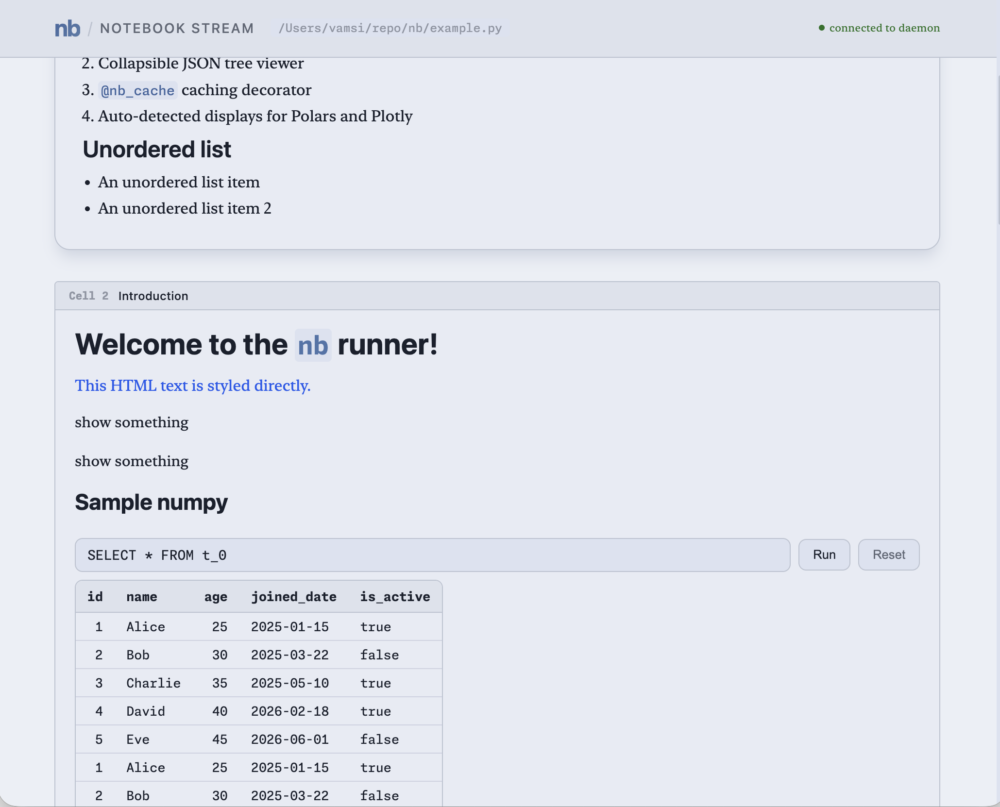

# nb

A lightweight Python notebook runner. Notebooks are plain `.py` files with `# %%`
cell delimiters — no JSON, no hidden state, fully diffable and git-friendly. A persistent
daemon executes them cell-by-cell and streams output to a live web UI.



```python
# %% Imports
import polars as pl
from nb import display, nb_cache

# %% Hello
display("# Welcome to `nb`", as_="md")
display(pl.DataFrame({"id": [1, 2, 3], "name": ["Alice", "Bob", "Eve"]}))
```

## Why nb

- **Plain `.py` files** — edit in your normal editor, review in normal diffs, no notebook merge conflicts.
- **Live reload** — `nb run -w` re-executes on every save and streams results to the browser.
- **One-way display surface** — the browser only *shows* output; no code or commands flow back from
  it to the daemon.
- **Smart caching** — `@nb_cache` memoizes expensive functions by hashing their source and inputs,
  surviving across runs.
- **Rich auto-detected output** — Markdown, HTML, Plotly, Altair, and Polars DataFrames render
  without extra ceremony.

## How it works

The repo has two sub-projects:

- **`nb/`** — the Python daemon, CLI, and execution framework (managed by [`uv`](https://docs.astral.sh/uv/)).
- **`nb-ui/`** — a Svelte 5 + Vite frontend (managed by [`pnpm`](https://pnpm.io/)).

A long-lived **daemon** holds a persistent import namespace (so the framework and its cache survive
between runs), while each run executes in a fresh exec namespace that's discarded afterward. The
runner parses cells, `exec`s each one, and emits Server-Sent Events (`cell_start`, `display_record`,
`cell_end`, …) that are fanned out to every connected browser at `http://localhost:7777`. Tables are
serialized as Parquet and rendered client-side with DuckDB-WASM.

## Install

Requires Python 3.13+ and `uv`.

```bash
make install        # uv sync --extra all --extra dev
```

To rebuild the bundled UI (served from `nb/static/`):

```bash
make build          # pnpm build + copy nb-ui/dist -> nb/static/
```

## Usage

Run the daemon once per project session, then trigger executions from a second terminal:

```bash
# Terminal 1 — start the daemon (serves http://localhost:7777)
uv run nb daemon .

# Terminal 2 — run a notebook
uv run nb run example.py

# Re-run automatically on every save (Ctrl-C to stop)
uv run nb run -w example.py
```

Open <http://localhost:7777> to watch output stream in live.

### Writing notebooks

Cells are delimited by `# %%`. Text after the delimiter becomes the cell title shown in the UI;
the module docstring becomes the notebook description.

```python
"""
Notebook description (Markdown supported).
"""

# %% Cell Title
display("## Hello", as_="md")
```

`display(obj, *, as_=None, label=None)` is the single output entry point. `as_` is one of
`md | html | text | object | table`, or omit it to auto-detect (Plotly figure → chart,
Altair chart → chart, Polars DataFrame → table, `str` → text, else → object inspector).

### Caching

`@nb_cache` memoizes a function by hashing its source plus its inputs. A purity linter runs at
decoration time and rejects functions that write to globals. `display(...)` calls made inside a
cached function are captured and replayed on a cache hit.

```python
@nb_cache
def get_data():
    display("Fetching…")
    return expensive_query()
```

Caches are cleared from the CLI, not from notebook code:

```bash
uv run nb run nb.py --clear-cache get_data         # clear one function
uv run nb run nb.py --clear-cache get_data,build   # clear several
uv run nb run nb.py --clear-cache-all              # clear everything
```

## Development

```bash
uv run pytest                         # run the Python test suite
cd nb-ui && pnpm dev                  # vite dev server (proxies /stream -> :7777)
cd nb-ui && pnpm format               # prettier
```

The full annotated API reference lives in [`skills/nb/guide.py`](skills/nb/guide.py) and
[`skills/nb/skill.md`](skills/nb/skill.md); [`example.py`](example.py) is a working sample notebook.
